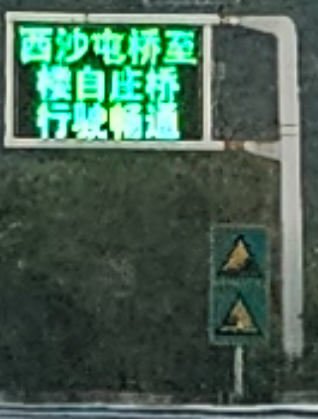
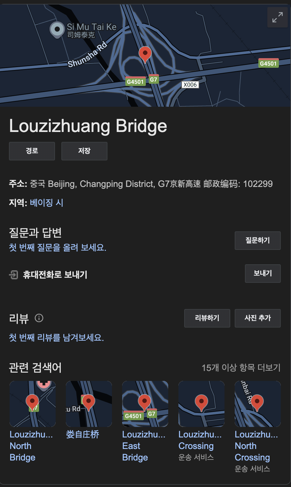
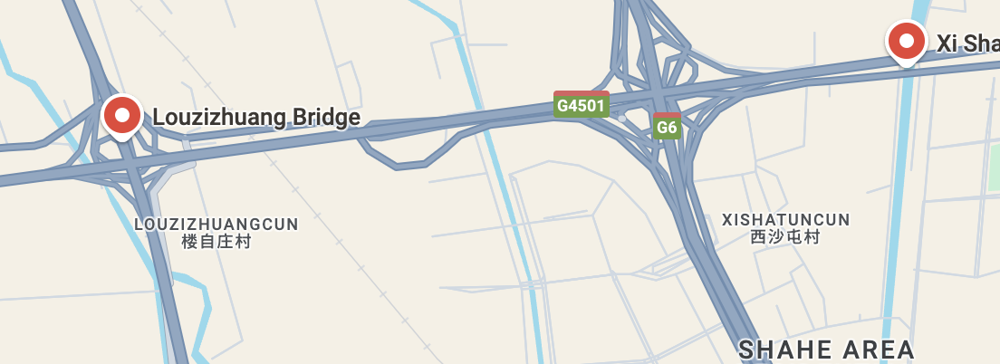
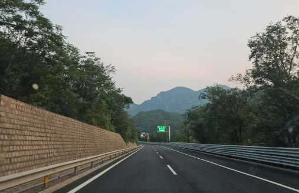

사진을 확대해보면 아래와 같은 중국어를 확인할 수 있다.



ChatGPT를 이용하여 번역해보면
```
西沙电桥: 시사 전기 다리
楼自庄桥: 루쯔좡 다리
行驶畅通: 통행 원활
```
라고 하는걸 확인할 수 있다.
다른 번역기를 쓰면
```
西沙屯桥至楼自庄桥 行驶畅通
```
이라고 알려준다.
```西沙屯桥```만 검색해보면


베이징 시에 있는 시샤툰 다리라는 것을 알 수 있다.
```楼自庄桥```만 검색해보면



동일한 베이징 시에 있는 루쯔좡 다리라는 것을 알 수 있으며

두 다리의 좌표를 같은 google maps의 지도상에 찍으면 아래와 같이 나온다.



일단 베이징 시라는 것을 알아냈고 추가로 아래의 힌트가 문제 설명에 적혀있다.
```
I took this picture while I was on a road trip. I distinctively remember that there was a body of water along this route, and there weren't many populated areas. Find the route number of the road I was on.

 

The flag is the route number and the 2-character abbreviation of the country it is in, seperated by an underscore (_). For example, if the route was route 23 in British Columbia, Canada, the flag would be irisctf{23_CA}.
```
길을 따라서 물이 있었고 사람이 많이 살지 않았다는 것 도로의 번호를 입력하면 되는 것다.
추가적으로 사진을보면 아래와 같이 산이 보인다.



해당 다리쪽을 가르키면서 주위에 물이 있고 직진으로 전진할 때 산이 보이는 도로명(S3801)을 넣으면 풀린다.

### flag
```
irisctf{S3801_CN}
```